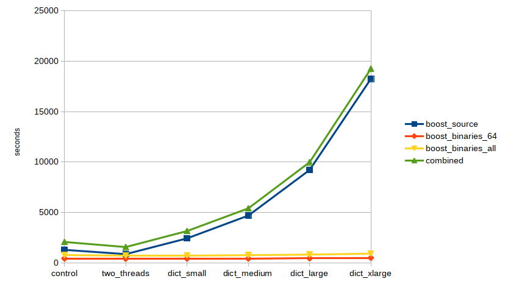
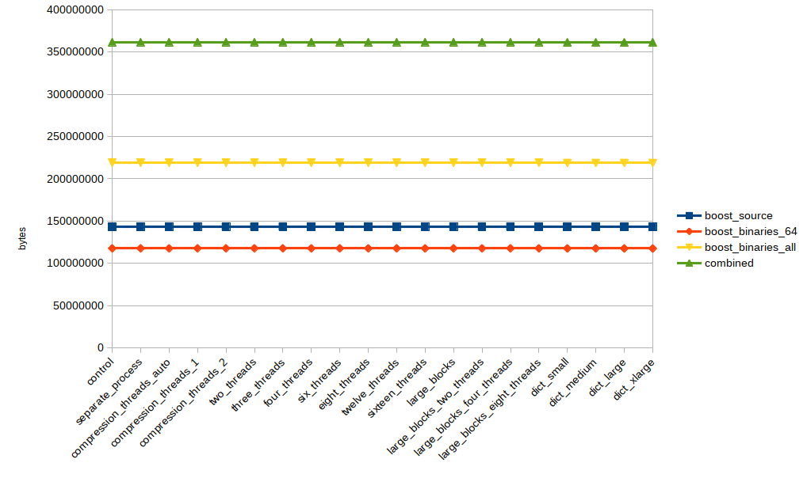
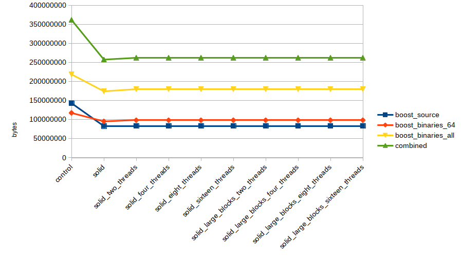

# Test of Inno Setup Settings

Initially written 2019-01-01.

I have been packaging boost
[windows binaries](https://github.com/teeks99/boost-release-windows/) for
distribution ([1](https://boost.teeks99.com),
[2](https://dl.bintray.com/boostorg/release/),
[3](https://sourceforge.net/projects/boost/files/boost-binaries/)) for many
years now. As long as I can remember, the longest part of the process (longer
than actually building the libraries!) is packaging them up as [Inno Setup](http://www.jrsoftware.org/isinfo.php)
installers. I've got a pretty good system now where I do a lot of the installer
compiles in parallel, but it has always annoyed me that the inno setup
compression seems to not be going very fast. I feel like file compression
should be easily parallelizable, but apparently it isn't.

Anyway, I put together this repo to find some answers.

## Initial Setup

The first test I ran was on a Microsoft Azure "F16" (or F16 v2?) virtual
machine. This has 16 Cores, 32GB of RAM, and a 128GB local storage (SSD?).

Looking at the documentation, I found a handful of variables that I wanted to
test:

*   [CompressionThreads](http://www.jrsoftware.org/ishelp/index.php?topic=setup_compressionthreads)
*   [LZMANumBlockThreads](http://www.jrsoftware.org/ishelp/index.php?topic=setup_lzmanumblockthreads)
*   [LZMAUseSeparateProcess](http://www.jrsoftware.org/ishelp/index.php?topic=setup_lzmauseseparateprocess)
*   [LZMADictionarySize](http://www.jrsoftware.org/ishelp/index.php?topic=setup_lzmadictionarysize)
*   [LZMABlockSize](http://www.jrsoftware.org/ishelp/index.php?topic=setup_lzmablocksize)

I used this initial template

```
; This is a template for an installer

[Setup]
AppName=Installer-Test
AppVerName=1.0-${Config}
AppPublisher=Boost Org
DefaultDirName=C:\local\test_1.0-${Config}
DefaultGroupName=none
DirExistsWarning=no
DisableStartupPrompt=yes
DisableProgramGroupPage=yes
DisableReadyMemo=yes
DisableReadyPage=yes
Compression=lzma2/ultra64
${SetupVariables}
OutputDir=.
OutputBaseFilename=test_1.0-${Config}
Uninstallable=no
PrivilegesRequired=lowest
VersionInfoTextVersion=test_1.0-${Config}
VersionInfoVersion=1.0

[Files]
Source: "${SourceDir}/*"; DestDir: "{app}"; Flags: ignoreversion recursesubdirs ignoreversion

[Messages]
SelectDirLabel3=Installed Test Files
```
Important to note here, the default setup uses `Compression=lzma2/ultra64`, 
so all the tests are running with that baseline.

To test these, I setup the following tests to fill the `${SetupVariables}` section:

*   control - no changes
*   separate_process - "LZMAUseSeparateProcess=yes"
*   compression_threads_auto - "CompressionThreads=auto"
*   compression_threads_1 - "CompressionThreads=1"
*   compression_threads_2 - "CompressionThreads=2"
*   two_threads - "LZMAUseSeparateProcess=yes", "LZMANumBlockThreads=2"
*   three_threads - "LZMAUseSeparateProcess=yes", "LZMANumBlockThreads=3"
*   four_threads - "LZMAUseSeparateProcess=yes", "LZMANumBlockThreads=4"
*   six_threads - "LZMAUseSeparateProcess=yes", "LZMANumBlockThreads=6"
*   eight_threads - "LZMAUseSeparateProcess=yes", "LZMANumBlockThreads=8"
*   twelve_threads - "LZMAUseSeparateProcess=yes", "LZMANumBlockThreads=12"
*   sixteen_threads - "LZMAUseSeparateProcess=yes", "LZMANumBlockThreads=16"
*   large_blocks - "LZMAUseSeparateProcess=yes", "LZMABlockSize=262144"
*   large_blocks_two_threads - "LZMAUseSeparateProcess=yes", "LZMABlockSize=262144", "LZMANumBlockThreads=2"
*   large_blocks_four_threads - "LZMAUseSeparateProcess=yes", "LZMABlockSize=262144", "LZMANumBlockThreads=4"
*   large_blocks_eight_threads - "LZMAUseSeparateProcess=yes", "LZMABlockSize=262144", "LZMANumBlockThreads=8"
*   dict_small - "LZMAUseSeparateProcess=yes", "LZMADictionarySize=131070"
*   dict_medium - "LZMAUseSeparateProcess=yes", "LZMADictionarySize=262140"
*   dict_large - "LZMAUseSeparateProcess=yes", "LZMADictionarySize=524280"
*   dict_xlarge - "LZMAUseSeparateProcess=yes", "LZMADictionarySize=1048576"

To test across various different types of files, I created four tests sets:

*   `boost_source` - the source files from the
    [boost 1.69.0 release](https://boost.teeks99.com/lib/1.69.0/boost_1_69_0.tar.bz2),
    this is about 60,000 files and 550MB extracted.
*   `boost_binaries_all` - msvc-14.1 (Visual Studio 2015) boost 
    [binaries](https://boost.teeks99.com/misc/inno_test/boost-bin-msvc14.1-all.tar.xz)
    (32&64 bit), this is 626 files and 3.5GB
*   `boost_binaries_64` - only the 64-bit version of the above, 313 files 1.95GB.
*   `combined` - combination of the source and 32&64 bit binaries, 60,000 files 4.11 GB

All this setup can be found in initial_test_set.json.

## Initial Results

After running the tests (they took about two days to complete!), I was able to
see how long each run took:


Unfortunately, those results were swamped by the incredible amount of time
things took with the modified dictionaries. Without those, we see some good
data:


Looking at this, it seems that adding a second thread (in the `two_threads`
test) drops the time significantly, but any more don't help. So it sounds
like `LZMANumBlockThreads=2` will be something I'll want to use. 

I was very disappointed that it doesn't seem like the LZMA compressor can 
work with more than two block threads. According to the documentation, with
the default LZMA `ultra64` compression, the `LZMADictionarySize` should be 
65535. Then the block size should be four times that or 262,140. If that is
in KB, then each block should be around 260MB. I could see this not impacting
the `boost_source` test, but expect it would have impacted the others.

Interestingly, the additional thread didn't have an impact on archives with a 
few, larger files. Aside from forcing `CompressionThreads` to `1`, they didn't 
move.

### Dictionary Size

Apparently modifying the dictionary size has a huge impact on the compile
runtime:



Don't modify the dictionary size.

### Size of output file

Since all these settings are impacting the output file, I wanted to check 
the difference in size between them:



Those lines don't look very exciting.

Looking at the percentage change of each file compared to the control is a
bit more interesting:


The modified dictionary size tests have a, very small, change. If you feel
like a tripling of the compile time for a 0.1% size improvement is worth it, 
you must have a very specialized use case.

## Trying it with a ramdisk

I was worried that the (pretty fast, ssd?) drive speed of the Azure F16 
machine might have been having an impact on these speeds. Since they weren't
getting faster, was it disk I/O bound? To try to eliminate this possibility, 
I setup a ramdisk on the machine. I used the 
[ImDisk](https://sourceforge.net/projects/imdisk-toolkit/) toolkit to create a 
12GB ramdisk (leaving 20GB of ram free) and ran the tests again from that 
drive.

Here's a graph with the initial results and the ramdisk results as well:


That did absolutely nothing. I was shocked, I would have expected some 
improvement for something that was dealing with so many/large files. At this 
point, I think I have to ask if the NTFS/Kernel overhead is limiting file I/O, 
but that is another investigation. However, the more likely scenario is that
this is limited by the couple of threads doing the compression being CPU/??? 
limited.

### Edit - Ramdisk check

I added a new python script, `disk_check.py` which simply loops through all 
the files in a given drive, does a CRC32 on them (the lightest-weight thing I 
could think of that uses all the bytes of a file) and returns the time it
took. F: is the ramdisk, D: is the traditional drive.

```
F:\inno-test>python disk_check.py boost_combined
Checking: boost_combined
Elapsed: 0:00:19.062858

D:\inno-test>python disk_check.py boost_combined
Checking: boost_combined
Elapsed: 0:04:32.586937
```

It doesn't seem like either the filesystem or kernel is the bottleneck. 
That means it **is** the compressor that is limiting things.

## Update - Testing with SolidCompression

Update - 2019-01-03

After I did the initial tests, I came across a 
[stack overflow post](https://stackoverflow.com/questions/40447498/best-compression-settings-in-inno-setup-compiler)
that mentioned the `SolidCompression=yes` [setting](http://www.jrsoftware.org/ishelp/index.php?topic=setup_solidcompression). 
I'm curious to see if that has an impact on more LZMANumBlockThreads. 

It turns out it has a huge impact!


This is the kind of multi-threaded compression I was expecting to see! As I
increase threads, for sufficiently large corpuses and with enough CPUs, the time 
goes down. 

As an added bonus, turning on the solid setting had a great impact on 
compression:



Why is this not the default???? It turns out there are some drawbacks, from 
the documentation:

>   The disadvantage to using solid compression is that because all files are 
>   compressed into a single compressed stream, Setup can no longer randomly 
>   access the files. This can decrease performance. If a certain file isn't 
>   going to be extracted on the user's system, it has to decompress the data 
>   for that file anyway (into memory) before it can decompress the next file. 
>   And if, for example, there was an error while extracting a particular 
>   file and the user clicks Retry, it can't just seek to the beginning of 
>   that file's compressed data; since all files are stored in one stream, it 
>   has seek to the very beginning. If disk spanning was enabled, the user 
>   would have to re-insert disk 1.

Actually, this doesn't bother me at all. 1) I don't have any dynamic nature to
my installation. The user installs all the files every time 2) I'll gladly 
pay the penalty of the user having to re-start the decompression for a file
that is 30-50% smaller and compressed much faster!

## Conclusion

It looks like I'm going to be adding `SolidCompression=yes` to my builds, 
along with an increase in the `LZMANumBlockThreads`. I'm thinking 6 or 8, for 
my builds, I have a ton of cores (I've been playing with running on the
Azure F72 instance, 72 Cores, 144GB RAM!), but I also have ten different
installers that I kick off in parallel.
